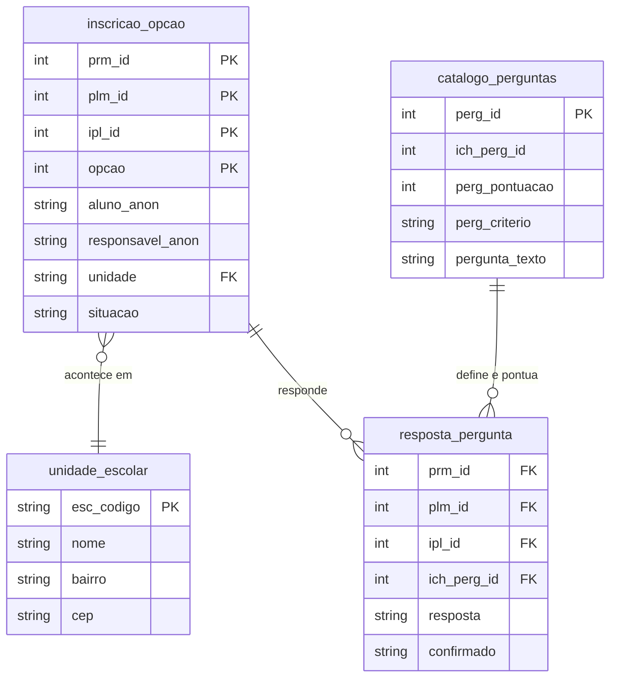

# 🎒 Claude Impact Lab 2026 | Dataset Inscrição Creche do Rio

[](https://www.anthropic.com) [](https://prefeitura.rio/)

---

> ### ⚠️ **Aviso Importante**
>
> Todos os dados do desafio passaram por rigoroso **processo de anonimização**, utilizando técnicas de aleatorização, generalização e supressão.
>
> **Indicadores gerados a partir dos dados NÃO representam a realidade**. Os dados apenas ilustram as dinâmicas do módulo de Inscrição Creche em anos anteriores.

---

## 📊 Acesso Rápido aos Dados

Todas as bases estão neste repositório. Basta clonar.

| 🗂️ **Tabela** | 📝 **Descrição** | 📁 **Pasta** |
| --- | --- | --- |
| **Bases Inscrição Creche** | Módulo de inscrição e classificação para alunos de creche | `Bases IC_ ClassificadoseFila/` |
| **Oferecimento e Vagas** | Vagas ofertadas e alunos inscritos por unidades parceiras e públicas | `OferecimentosEvagas/` |
| **Microáreas SME/IPP** | Bases para a criação de mapas com a dinâmica territorial usada pela SME | `Microáreas_SME_revisãoIPP/` |
| **Nascidos Vivos RJ** | Nascidos vivos no município, referência de demanda potencial | `NascidosvivosRJ.xlsx` |

---

## 📚 Materiais de Apoio

- Apresentação: [Acessar](https://rioeduca-my.sharepoint.com/:p:/g/personal/gabrielledomingues_rioeduca_net/IQAlvS8n9w7OQ6WcJK2T-wr6AVcXGJuT7MdyJ41qQtqlff0?e=xkQwfk)
- Briefing (problema completo): [Acessar](https://docs.google.com/document/d/1jZenYEKR2hJOVrxLXWM0xjxmoiohAqEl/edit?usp=sharing)

---

## 📘 Dicionário de Dados

### Escopo

A extração cobre 5 processos seletivos: **179 (2021)**, **181 (2022)**, **184 (2023)**, **194 (2024)** e **195 (2025)**. O processo vigente (2026) não está incluído.

Os arquivos ficam em `Bases IC_ ClassificadoseFila/`. As duas bases maiores estão compactadas em `.gz` (o GitHub recusa arquivos acima de 100 MB); o conteúdo é idêntico ao CSV original. Todos usam separador `;` e codificação UTF-8 com BOM. Detalhes de leitura e limites de memória em [`README_dicionario_dados.md`](Bases%20IC_%20ClassificadoseFila/README_dicionario_dados.md).

| Arquivo | Linhas | Grão |
| --- | ---: | --- |
| `01_QueryA_InscricoesPorAno.csv.gz` | 837.179 | uma opção de creche escolhida |
| `02_QueryB_RespostasSocioEconomicas.csv.gz` | 4.357.119 | uma pergunta respondida |
| `03_QueryC_PerguntasComDescricao.csv` | 65 | uma pergunta por processo/ano |
| `04_UnidadesEscolaresComEndereco.csv` | 2.188 | uma unidade escolar |

### Modelo de Dados



### Query A — `01_QueryA_InscricoesPorAno`

Uma linha por **opção de creche escolhida** dentro de uma inscrição. Uma criança aparece em várias linhas (uma por opção) e pode reaparecer em anos diferentes. São 343.308 inscrições distintas e 872 unidades. Junta com a Query B pela chave `(prm_id, plm_id, ipl_id)` e com a Query D pela coluna `unidade`.

| Coluna | Tipo | Descrição |
| --- | --- | --- |
| `ano` | int | Ano do processo seletivo (2021–2025) |
| `prm_id` | int | Identificador do processo de matrícula |
| `plm_id` | int | Identificador do polo/lote dentro do processo |
| `ipl_id` | int | Identificador da inscrição dentro do polo |
| `opcao` | int | Ordem da opção escolhida pela família (1ª, 2ª...) |
| `unidade` | string | Código da unidade escolar — junta com a 2ª coluna da Query D |
| `nome_unidade` | string | Nome da unidade escolar |
| `grupamento` | string | Faixa/grupamento etário-curricular (ex.: Berçário, Maternal) |
| `horario` | string | `Integral` ou `Parcial` |
| `data_criacao` | datetime | Data/hora de criação da inscrição |
| `aluno_anon` | string | Código anonimizado da criança — estável entre opções e entre os 5 processos |
| `sexo_crianca` | string | `M` ou `F`, sem nulos |
| `nascimento_aluno_anomes` | string (`yyyy-MM`) | Ano-mês de nascimento — generalizado por privacidade (sem o dia) |
| `responsavel_anon` | string | Código anonimizado do responsável 1 |
| `CEP` | string, nulo em 2,8% | CEP do endereço do responsável |
| `bairro` | string, nulo em 2,8% | Bairro do endereço do responsável |
| `situacao` | string | Status da opção — ver tabela abaixo |

**A base não vem filtrada por situação.** Todos os desfechos estão presentes, inclusive os cancelamentos — que são a maioria. Filtre conforme a sua pergunta de análise:

| `situacao` | Linhas | % |
| --- | ---: | ---: |
| `Cancelado pelo sistema` | 326.316 | 39,0% |
| `Confirmado` | 192.570 | 23,0% |
| `Lista de espera` | 178.731 | 21,3% |
| `Cancelado na confirmacao` | 118.816 | 14,2% |
| `Cancelado` | 18.722 | 2,2% |
| `Selecionado da lista` | 1.191 | 0,1% |
| `Ativo` | 606 | 0,1% |
| `Selecionado` | 227 | 0,0% |

> ⚠️ **Atenção ao acento.** O valor gravado é `Cancelado na confirmacao`, **sem cedilha e sem til**. Filtrar por "Cancelado na confirmação" devolve zero linhas.

Sobre `opcao`: a maioria das famílias indica até 5 opções, mas existem 11 linhas com `opcao = 6`.

### Query B — `02_QueryB_RespostasSocioEconomicas`

Uma linha por **pergunta respondida** dentro de uma inscrição (formato longo). Chave: `(prm_id, plm_id, ipl_id, ich_perg_id)`.

| Coluna | Tipo | Descrição |
| --- | --- | --- |
| `ano` | int | Ano do processo |
| `prm_id`, `plm_id`, `ipl_id` | int | Chave da inscrição — liga com a Query A |
| `ich_perg_id` | int | Identificador da pergunta *nesse processo específico* (muda a cada ano) |
| `pergunta_texto` | string | Texto completo da pergunta, sem nulos |
| `pergunta_legenda` | — | **Coluna vazia**: nula em 100% das linhas. Use `pergunta_texto` |
| `pergunta_ordem` | int | Ordem de exibição da pergunta no formulário |
| `resposta` | `Sim` / `Nao` | Resposta da família — sem nulos. 410.878 `Sim` (9,4%) |
| `confirmado` | `Sim` / `Nao` | Se a resposta foi confirmada/validada — sem nulos. 541.665 `Sim` (12,4%) |

**Qualidade da junção com a Query A:** de 4.357.119 linhas, apenas 221 não têm inscrição correspondente. Na direção oposta, 8.162 das 343.308 inscrições (2,4%) não têm nenhuma resposta registrada.

### Query C — `03_QueryC_PerguntasComDescricao`

O catálogo de perguntas de cada processo — **e a régua de pontuação usada para classificar a fila**. São 13 perguntas por ano, 24 perguntas distintas ao longo dos 5 anos.

| Coluna | Tipo | Descrição |
| --- | --- | --- |
| `ano` | int | Ano do processo |
| `prm_id` | int | Identificador do processo de matrícula |
| `ich_perg_id` | int | Instância da pergunta naquele ano — **é esta que junta com a Query B** |
| `perg_id` | int | Identificador estável da pergunta no catálogo geral, o mesmo entre anos |
| `pergunta_texto` | string | Texto completo da pergunta |
| `pergunta_legenda` | — | **Coluna vazia** nas 65 linhas |
| `perg_ordemVisualizacao` | int | Ordem de exibição no formulário |
| `perg_pontuacao` | int | **Pontos que a pergunta vale na classificação** (0 a 100) |
| `perg_criterio` | `Sim` / `Nao` | `Sim` marca pergunta usada como critério de desempate, não como pontuação — equivale exatamente a `perg_pontuacao = 0` (10 das 65 linhas) |

Use `perg_id` para comparar a mesma pergunta entre anos, e `ich_perg_id` para juntar com as respostas.

**A régua mudou de forma relevante no período.** O questionário foi redesenhado entre 2023 e 2024: das 13 perguntas de 2023, só 3 sobreviveram em 2024. E o peso das que ficaram foi reescalonado — a pergunta sobre deficiência da criança (`perg_id = 2`) valia 100 pontos de 2021 a 2023 e passou a valer 25 em 2024. Comparar anos sem levar isso em conta produz série temporal falsa.

### Query D — `04_UnidadesEscolaresComEndereco`

Catálogo de endereços das unidades escolares. Traz 2.188 unidades, das quais 872 aparecem na Query A — as demais são unidades da rede que não receberam inscrição de creche nos processos extraídos.

> ⚠️ **Este arquivo não tem linha de cabeçalho.** Ele começa direto no dado. Leia com `header=None` (pandas) ou `header = FALSE` (R), senão você perde a primeira unidade e fica com nomes de coluna inválidos.

| Posição | Conteúdo | Observação |
| ---: | --- | --- |
| 0 | Identificador sequencial interno | 1 a 2.188 — **não** junta com nada |
| 1 | **Código da unidade** (`esc_codigo`) | **É esta que junta com `unidade` da Query A** — casa 872/872 |
| 2 | Nome da unidade | |
| 3 | Código do tipo de unidade | |
| 4 | Logradouro | vazio em 258 linhas |
| 5 | Número | vazio em 258 linhas |
| 6 | Complemento | vazio em 1.880 linhas |
| 7 | Bairro | vazio em 258 linhas |
| 8 | CEP | vazio em 258 linhas |

```python
import pandas as pd
d = pd.read_csv("04_UnidadesEscolaresComEndereco.csv", sep=";", header=None,
                encoding="utf-8-sig", na_values=["NULL"],
                names=["seq","esc_codigo","nome","tipo","logradouro",
                       "numero","complemento","bairro","cep"])
```

## 🔒 Processo de Anonimização

### 🛡️ Técnicas Aplicadas

| 🔧 Técnica | 📝 Descrição |
| --- | --- |
| 🔐 **Códigos artificiais** | Criança e responsável recebem códigos (`aluno_NNNNNNN`, `responsavel_NNNNNNN`) gerados a partir de uma chave natural (CPF/DNV/NIS/nome+nascimento); o mesmo código se repete para a mesma pessoa em todas as opções e nos 5 processos em que ela aparecer |
| 📅 **Generalização temporal** | Nascimento da criança exposto só como ano-mês (`yyyy-MM`), sem o dia; nascimento do responsável não é exposto |
| 📍 **Generalização geográfica** | Do endereço do responsável só saem bairro e CEP — sem logradouro, número ou telefone |
| 🚫 **Supressão de identificação direta** | Nome do responsável, CPF, DNV, NIS e demais identificadores diretos não são expostos, apenas os códigos anonimizados |

### ⚠️ Impactos da Anonimização

**❌ O que NÃO representa a realidade:**

- Indicadores absolutos
- Endereço exato de famílias e unidades (fica só em nível de bairro/CEP)
- Identidade real de crianças e responsáveis
- Data exata de nascimento das crianças

**✅ O que está preservado:**

- Sequência temporal do processo (inscrição → classificação → convocação)
- A trajetória de uma mesma criança/responsável entre opções de creche e entre os 5 anos do processo — 34.486 crianças (13,3% das 259.924) reaparecem em mais de um ano, e o código as acompanha
- Lógica territorial ao nível de bairro
- Relações entre as bases (inscrição, opções, respostas de classificação)
